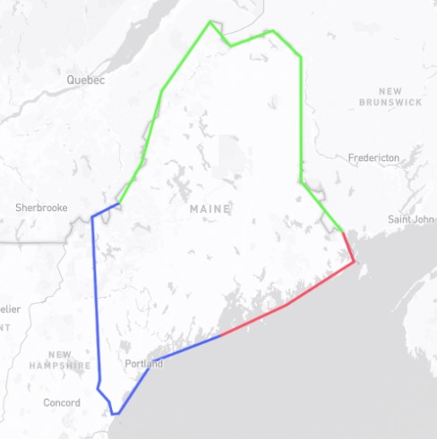

# Testing Data Infrastructure & Analysis
Silahkan mengerjakan sesuai kemampuan Anda, Deadline 18 September 2023, jam 10:00 WIB. Fork repository ini, kirim "Pull Request" jika anda sudah selesai atau kirim email ke royyan@satunol.com.
## Kuis

- [?] Anda memiliki tabel "Orders" dengan kolom-kolom berikut: "OrderID," "CustomerID," "OrderDate," dan "TotalAmount." Tuliskan sebuah kueri SQL untuk menampilkan semua pesanan yang dibuat oleh pelanggan dengan ID tertentu pada tanggal tertentu.
- [?] Bagaimana Anda akan mengimplementasikan pengolahan data real-time dalam infrastruktur data? Berikan contoh kasus penggunaan di mana pengolahan data real-time sangat penting.
- [?] Mengapa keamanan data sangat penting dalam infrastruktur data? Sebutkan beberapa langkah atau teknik yang dapat digunakan untuk melindungi data yang disimpan dan diproses.
- [?] Bagaimana Anda akan menangani situasi di mana server database mengalami gangguan atau kegagalan yang mengancam kontinuitas operasional? Jelaskan tindakan darurat yang akan Anda lakukan.
- [?] Bagaimana Anda akan merencanakan dan mengembangkan infrastruktur data yang lebih besar untuk mendukung pertumbuhan bisnis? Jelaskan tahapan utama yang akan Anda lakukan.
- [?] Mengapa visualisasi data penting dalam analisis data? Berikan contoh alat atau teknik yang biasa digunakan untuk membuat visualisasi data yang efektif.
- [?] Jelaskan apa yang anda ketahui tentang: Race Condition, Deadlock, Indexing, Normalization, Replication, Backup and Restore, Data Migration dalam database. Jelaskan juga pengalaman anda yang pernah anda hadapi berhubungan dengan istilah-istilah tersebut.

## Alghoritma
Kerjakan dengan menggunakan bahasa pemograman yg anda kuasai, buat folder terpisah untuk soal ini
- [!] Anda memiliki dua buah array, yaitu DATA dan QUERIES, tentukan berapa kali setiap kata dalam QUERIES muncul dalam array DATA. Buatlah sebuah fungsi atau program untuk menghasilkan output yang berisi jumlah kemunculan setiap kata dalam QUERIES dalam DATA. 
Contoh:  
```
DATA = ['aple', 'banana', 'cherry', 'banana', 'apple']
QUERIES = ['apple', 'banana', 'grape']

# Fungsi atau program Anda akan menghasilkan output berupa list, seperti ini:
# [2, 2, 0]

# Penjelasan:
# - Kata 'apple' muncul 2 kali dalam DATA.
# - Kata 'banana' juga muncul 2 kali dalam DATA.
# - Kata 'grape' tidak muncul sama sekali dalam DATA.
```
- [!] Silahkan cari hasil dari pengurangan dari jumlah diagonal sebuah matrik NxN Contoh:

Contoh:
```
Matrix = [[1, 2, 0], [4, 5, 6], [7, 8, 9]]

diagonal pertama = 1 + 5 + 9 = 15 
diagonal kedua = 0 + 5 + 7 = 12 

maka hasilnya adalah 15 - 12 = 3
```

- [!] Dengan menggunakan [Mapbox](https://docs.mapbox.com/help/glossary/mapbox-gl-js/) tambahkan polygon pada peta dengan tiga garis warna yang berbeda. 



## Challenge
Rancang solusi untuk mengolah data streaming secara real-time, seperti data sensor dari perangkat IoT. Rinci alat atau teknologi yang akan digunakan, serta langkah-langkah yang akan diambil dalam mengatasi masalah data streaming. Tambahkan link figma atau canva untuk mendukung penjelasan konsep anda dengan gambar flowchart yang baik.